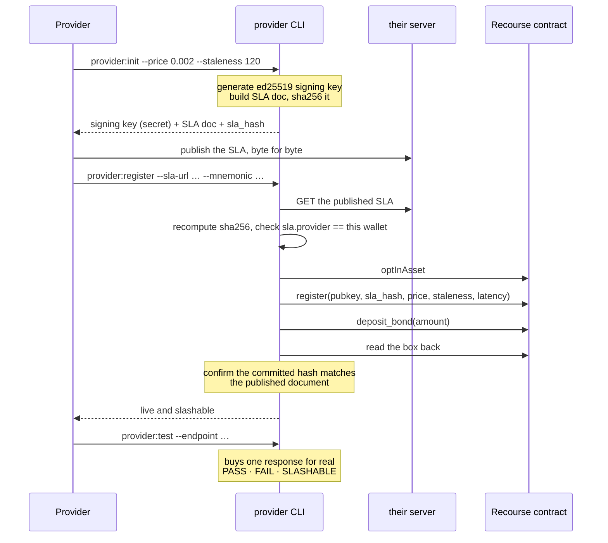
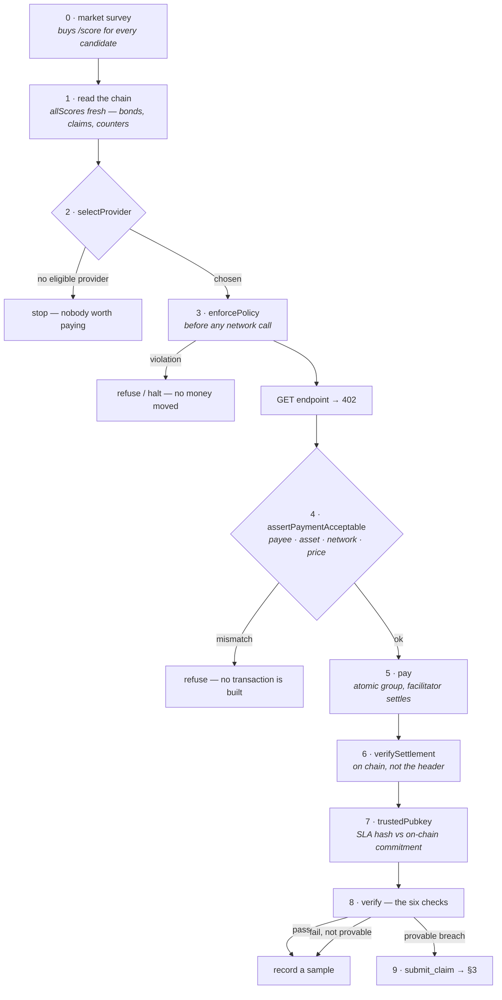
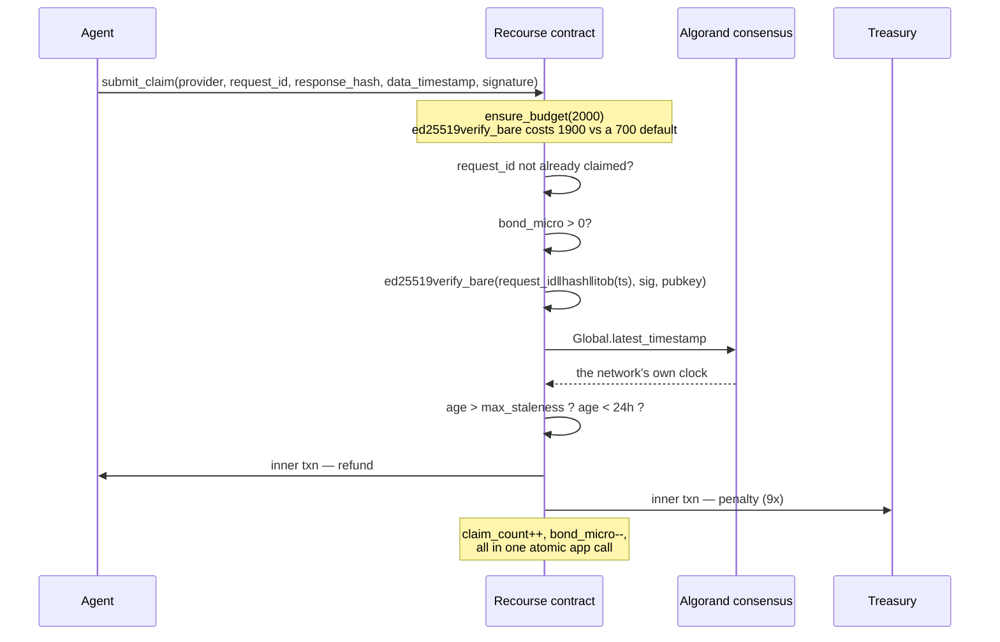
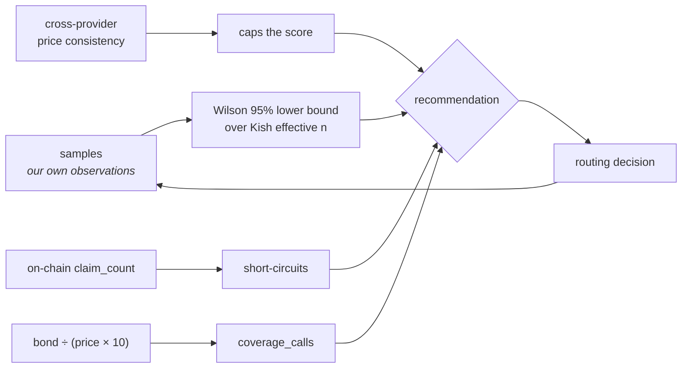

# What actually happens

Every sequence in this document is traced from the code, with file and function
names, so it can be checked rather than believed. Four flows:

1. [A provider joins](#1--a-provider-joins) — key, SLA, registration, collateral
2. [An agent buys something](#2--an-agent-buys-something) — the loop that runs 26 times
3. [A breach is proven](#3--a-breach-is-proven) — what the contract does alone
4. [The score changes what happens next](#4--the-score-changes-what-happens-next)

If you only read one thing, read [§3](#3--a-breach-is-proven). Everything else
exists so that the contract has something honest to decide on.

---

## 1 · A provider joins

Nobody approves this. `register` and `deposit_bond` both key off `Txn.sender`,
so a provider enrols itself and no operator — including us — can enrol it, block
it, or move its bond.



**Two keys, deliberately.** The response-signing key is not the key holding the
bond. Signing happens on every request, so that key is hot by definition; the
bond key signs twice in its life. A compromised web server leaks the ability to
sign responses, not the collateral.

**What lands on chain** — a 129-byte fixed struct in box storage
([`contract.py`](contracts/recourse/contract.py)):

| Field | Meaning |
|---|---|
| `pubkey` | the key every response will be signed with |
| `sla_hash` | sha256 of the published SLA document |
| `price_micro`, `max_staleness`, `max_latency_ms` | the promise, in the provider's own words |
| `bond_micro` | collateral held by the app account |

Once bonded, **the terms freeze**. `register()` asserts
`bond_micro == 0` before accepting changes — otherwise a provider caught
red-handed could widen its own SLA and void every pending claim.

---

## 2 · An agent buys something

One iteration of the loop in [`runner.ts`](src/agent/runner.ts). It runs with no
human in it: the agent holds its own wallet, declares its own limits, and
approves its own payments.



### The order is the point

**Policy is checked first, before anything happens.** A stop at step 3 costs
nothing and moves nothing, which is what makes it a real control rather than an
apology:

| Control | Stops |
|---|---|
| `allowedHosts` | "pay `attacker.example`" — never reaches the network |
| `requireApprovalAboveMicro` | anything unusually large stops and asks a human |
| `maxPerPaymentMicro` | one hostile 402 demanding far above list price |
| `sessionBudgetMicro` | a run of individually-reasonable payments |
| `maxPaymentsPerMinute` | a runaway loop, bounded in time as well as money |
| `haltAfterConsecutiveRefusals` | systematic wrongness — the agent stops for good |

The session budget is the one that matters most: **a subverted agent does not
need to overpay once, it only needs to keep paying.**

### Step 4 — reading the 402 before building a payment

`pay()` wraps `fetch` so it can inspect the challenge *before* the payment layer
acts on it. Reading a header does not consume the body, so the wrapper still
sees an intact response:

```ts
if (res.status === 402) {
  assertPaymentAcceptable(res.headers.get("PAYMENT-REQUIRED"), expect);
}
```

Without this, an agent that carefully checks a provider's collateral then pays
whatever address the 402 happens to name is trusting the *endpoint*, not the
*registry*. A compromised host could collect real money under a bonded
provider's reputation — and nothing would be claimable, because the bonded
provider never signed anything.

### Step 6 — not taking the facilitator's word

The facilitator returns a transaction id. That id is checkable, so it gets
checked ([`verifySettlement`](src/lib/chain.ts)): the transaction exists, it is
an asset transfer, and the asset, amount, sender and receiver are all what was
agreed. A settlement the chain does not corroborate is logged as a facilitator
failure and never counted as a purchase.

### Step 7 — chain of custody on the signing key

The agent never trusts a key just because the server served it:

```
read sla_hash from the chain
   → fetch the provider's published /sla
   → recompute sha256(canonical_json(sla))
   → compare.  differ → trust nothing
   → only then take signing.pubkey_b64 from inside
```

The chain is the anchor; the server is only delivery.

### Step 8 — the six checks

| # | Check | Catches |
|---|---|---|
| 1 | `http_200` | outright failure |
| 2 | `required_fields` | data served with no proof attached |
| 3 | `latency` | slowness — *never slashable, see below* |
| 4 | `staleness` | data older than the provider's own bound |
| 5 | `response_hash` | any byte altered in flight |
| 6 | `signature` | forgery, or a key that is not the registered one |

**Not every failure is punishable.** A violation is claimable only when:

```ts
provableViolation: sigOk && !stalenessOk && schemaOk
```

A timeout is not claimable — there is no signature to point at. A bad hash is
not either — that means somebody tampered, and the provider may be the victim.
**We only ever slash on evidence the provider produced themselves.**

Latency is measured but never slashed: x402 settles on chain *before* the
resource returns, so ~4.5s of blockchain time sits inside every measurement.
That makes it unattributable, and we say so rather than punishing for it.

### Attribution

A sample is only recorded when `outcome.attributable` — meaning the x402
exchange itself completed. If the payment layer failed, the provider never had a
turn, and counting it would let one facilitator outage tank every provider's
score at once for something none of them did.

---

## 3 · A breach is proven

This is the part with no people in it.



The contract redoes the work itself. The agent's verdict counts for nothing:

```python
# 1. The provider signed this exact response with this exact timestamp.
msg = request_id + response_hash + op.itob(data_timestamp)
assert op.ed25519verify_bare(msg, signature, p.pubkey.bytes), "bad signature"

# 2. That timestamp violates the bound the provider published.
assert Global.latest_timestamp > data_timestamp, "timestamp in the future"
age = Global.latest_timestamp - data_timestamp
assert age > p.max_staleness.native, "within SLA"
assert age < MAX_CLAIM_AGE_SECONDS, "too old to claim"
```

### Two clocks, two purposes

|  | Agent-side check | Contract-side check |
|---|---|---|
| Clock | `Date.now()` — the agent's own machine | `Global.latest_timestamp` — **the chain's** |
| Cost | free | a transaction |
| Decides | *do I buy from them again?* | *do they lose money?* |
| Trusted by | only the agent | **everyone** |

The agent's clock is fine for deciding where to spend its next penny. It is
useless for taking someone's collateral — nobody would accept *"my laptop said
you were late"* as grounds to be fined. `Global.latest_timestamp` is agreed by
consensus across every node, and neither party can nudge it.

> **The agent's clock is enough to make a decision. Only the chain's clock is
> enough to make a judgement.**

When money moves, three independent things had to line up: the provider's own
signature, the provider's own published bound, and a clock neither party
controls. There is no arbitrator anywhere in that sentence.

### If the bond cannot cover it

```python
if total > p.bond_micro.native:
    refund = p.bond_micro.native   # pay out what remains
    penalty = UInt64(0)
    p.active = arc4.Bool(False)    # and take the provider offline
```

Insurance can be insolvent. The guarantee is capped at the live bond, and the
provider is delisted when it runs out.

---

## 4 · The score changes what happens next



**The agent acts on the lower bound, never the point estimate.** A provider at
2-for-2 looks like "100%", but two data points prove nothing — the 95% lower
bound reads about 34%, which is what *"we barely know them"* should look like.
As samples accumulate the two converge.

**`unrated` is a distinct verdict.** Not enough evidence is not the same as bad
evidence, and conflating them is how new providers get frozen out.

**Exploration is bond-scaled.** A brand-new provider still gets traffic, because
its *bond* — not a reputation it cannot yet have — is what protects the buyer. A
thin bond buys proportionally less rope.

**Volume is not evidence — counterparties are.** A provider can pay itself all
day, and on a public chain that costs it only fees. So self-payments are
excluded outright rather than discounted, and confidence is capped at `medium`
while every observation traces back to a single payer.

That cap is deliberately not a penalty. A brand-new honest provider has exactly
one customer; so does one quietly paying itself. A score penalty cannot tell
them apart and would hit the honest one hardest — the incumbent-protecting
behaviour this project exists to remove. Declining to claim *high* confidence
says the true thing, that our evidence is narrow, without pretending to know
which case it is. `medium` still permits a `buy`, so a thin market is never a
barrier to traffic.

**Evidence and proof do different things:**

| | Source | Consequence |
|---|---|---|
| **Proof** | a signature the provider produced | collateral moves |
| **Evidence** | a statistic across the market | traffic moves |

Cross-provider price consistency catches a forger that passes all six
cryptographic checks — one that serves 45-minute-old data stamped `now()`. It
disagrees with everyone else about the moment it named. But that finding
**caps the score and never touches the bond**: slashing on a statistical
inference would be exactly the centralised adjudication this project exists to
remove.

> Proof takes money. Evidence takes customers.

---

## Where each piece lives

| Flow | Code |
|---|---|
| Provider onboarding | [`src/scripts/provider.ts`](src/scripts/provider.ts) |
| The agent loop | [`src/agent/runner.ts`](src/agent/runner.ts) |
| Policy, payment, verification | [`src/lib/recourse-client.ts`](src/lib/recourse-client.ts) |
| Settlement checking, box decoding | [`src/lib/chain.ts`](src/lib/chain.ts) |
| Canonical JSON, hashing, signing | [`src/lib/signing.ts`](src/lib/signing.ts) |
| Scoring | [`src/lib/scoring.ts`](src/lib/scoring.ts) · [`src/lib/consistency.ts`](src/lib/consistency.ts) |
| Paid routes, 402 construction | [`src/x402.ts`](src/x402.ts) |
| The contract | [`contracts/recourse/contract.py`](contracts/recourse/contract.py) |

Related: [SECURITY.md](SECURITY.md) for the attack surface,
[FEATURES.md](FEATURES.md) for what is and is not built,
[DEMO.md](DEMO.md) for running it yourself.
